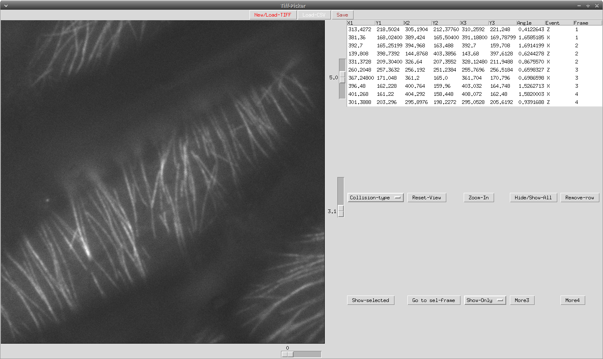

# Collision Browser Documentation.

The collision events were recorded using the python script `collbrowser.py`. The required steps required to use the script are as follows.

The script has been used and tested in Linux, Windows and macOS. 

## Download and Install.

The script is written in Python 3.7.x and has some dependencies which need to be satisfied, the most important

1. [skimage](https://scikit-image.org/)
2. [tkinter](https://docs.python.org/3/library/tkinter.html#module-tkinter)
3. [pillow](https://pypi.org/project/Pillow/)
4. [glob](https://docs.python.org/3/library/glob.html)
5. [csv](https://docs.python.org/3/library/csv.html)
6. [numpy](https://numpy.org/doc/stable/index.html)
7. [operator](https://docs.python.org/3/library/operator.html)
8. [pandas](https://pandas.pydata.org/)

Apart from skimage and pandas, all the other modules are standard modules which are included in any standard python install. 

In any case we tested the script using fresh installs of [anaconda](https://www.anaconda.com/) which is an excellent and easy to use distribution and package manager. For windows user it also has the advantahe of including a powershell which is necessary in the remaining steps.

Once all the dependencies are correctly installed, the next step is to download the file `collbrowser.py` and place it in a folder which can be accesed through a terminal. 

In a terminal execute the command:

```
>python collbrowse.py
```
which should open a window similar to the one in Figure 1.


**Figure 1:** GUI initial aspect.

The top bar contains three buttons Load/New-TIFF, Load-CSV, Save. These load one of the tiff files analysed, load a collision's file and save the file if new collisions are added.

The tiff files analysed and the respective results are:

Hypocotyl cells:

1. hypocotyl1_GFPtubulin.tiff - ALLH1.csv
2. hypocotyl2_GFPtubulin.tiff - ALLH2.csv
3. hypocotyl3_GFPtubulin.tiff - ALLH3.csv
4. hypocotyl4_GFPtubulin.tiff - ALLH4.csv
5. hypocotyl5_GFPtubulin.tiff - ALLH5.csv


Pavement cells:

1. Pavement cell1 image stack.tif - P1-200FR.csv
2. Pavement cell2 image stack.tif - P2-300FR.csv
3. Pavement cell3 image stack.tif - P3-300FR.csv

In order to browse the data the tiff file and the data files to be loaded need to be paired as listed above. 

Once a pair of images and data are loaded the application should look like Figure 2 below.



**Figure 2:**  GUI with loaded data and images.

### Data editing and browsing.

The application has eight buttons which allow the user to browse the recorded data, which can be grouped in two categories: Add-edit-remove data and explore data.


**Add-edit-remove data:**  Using the left/right keys the script allows to change frame and navigate across the file. If a collision event is detected then using the the mouse left button we can select three points which define a collision angle. Once the angle has been selected then we can select the type of event from the Collision-type button.

1. Collision-type: For a given row it assigns an event type from the set {U,X,Z,K} which stand for U-undefined, X-crossing, Z-zippering and K-catastrophe.
2. Remove-row: In the table displaying the results the mouse allows to select a row, then pressing this button will erase it.

**Data browsing**: If there is data loaded or captured in the table, browsing through the frames will show the collisions in the current frame, unless some of the actions below are activated.

The buttons with actions which help filtering and browisng the data are:

1. Show selected: Selecting a row and pressing this buttons displays the event in that row, without changing frame.
2. Go to sel-frame: Goes to the frame in the selected row and displays the events in such frame.
3. Show-Only: Displays only the type of events chosen (Z,X,K or U).
4. Reset-view: Using the mouse's right button we can span a square to zoom-in.
5. Zoom-In: Once a zoom-in square is defined it zooms to that square.

6. Hide/Show-All: Hides or shows all the events. This in combination with show selected and go to frame allows for different ways to explore data. 

7. Reset view: Resets the view to the original view (Un-zoomed).

The figure below show some events, notice that the square symbol corresponds always to the first point in the table (X1,Y1).


For the dataset analysed with this tool the images have a resolution of 512x512 pixels except for Pavement cell2 image stack.tif and Pavement cell3 image stack.tif, which have  370 x 354 pixels and 314x512 pixels. In both cases the displayed images are patched to be squares of 512x512 pixels.

The number of frames in the script is a parameter in the code equal to 300 frames, for movies with less frames the image above the last frame, remains the last frame.


